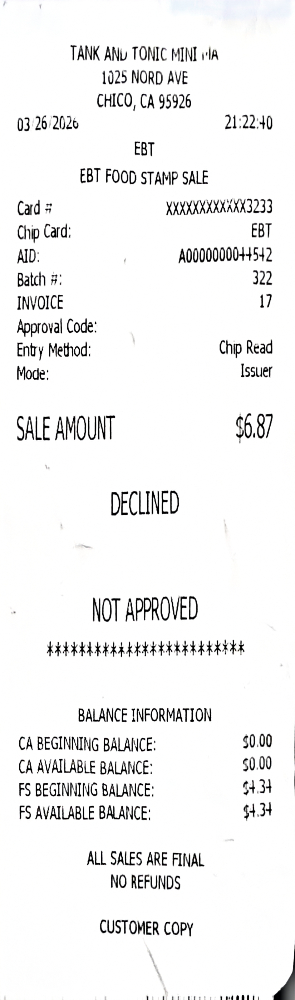
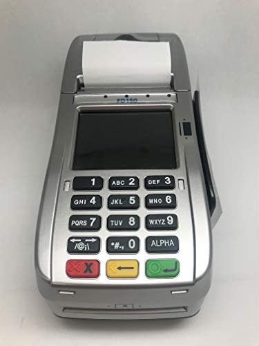

# [ux-portfolio-Tiggzzz](../README.md)
# Using Remaining Balance
When it gets closer to the end of the month, my [SNAP/EBT](https://www.fns.usda.gov/snap/ebt) funds begin to run low or even reach zero. As a college student it's my priority save as much money as I can, so often I want to use all my SNAP funds. A common technological interaction I run into is when I try to make a purchase with a greater total than my remaining SNAP funds. In this situation I would like to use all of my remaining SNAP funds and subsequently cover the remaining transaction total with some other payment method. However instead the transaction is declined.

The transaction shown bellow is an exmaple of an unaproved transaction with a sale amount of $6.87 and a SNAP balance of $4.34.

The interaction shown above consisted of me inserting my EBT Card into a card terminal, inputing my pin, seeing declined on the screen, and reciveing the recepit shown above. After my transaction was declined I removed my EBT card and asked the clerk if she could use my remaining balance. She then created a sale mathcing my SNAP balance and finally I had to reinsert my EBT card and input my pin. After this sale was aproved She created another sale with the remaining sale amount where I payed with my debit card.

